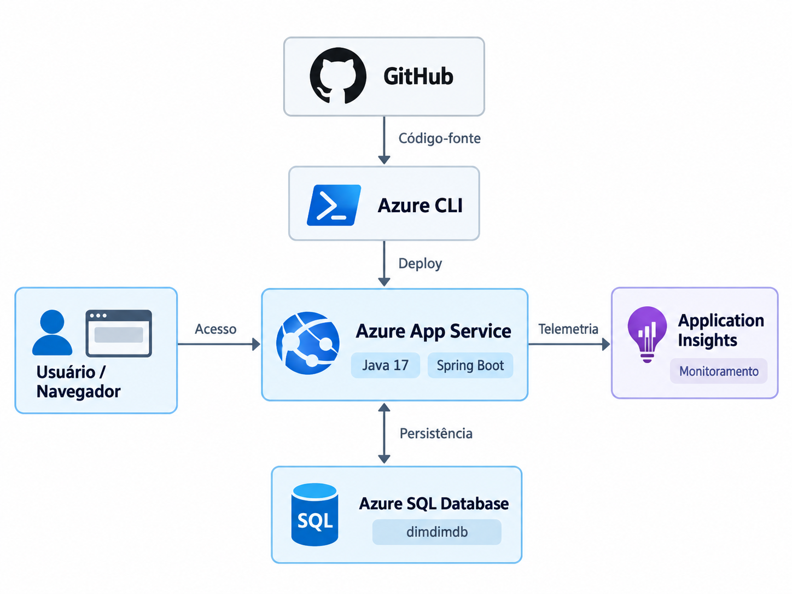

# DimDim

Projeto desenvolvido para a disciplina **DevOps Tools & Cloud Computing**, com o objetivo de aplicar conceitos de desenvolvimento Web, banco de dados PaaS, deploy automatizado em nuvem e monitoramento utilizando serviços Microsoft Azure.

## Sobre a solução

O **DimDim** é uma aplicação Web desenvolvida em Java com Spring Boot para controle simples de receitas e despesas.

A aplicação possui interface Web e permite o gerenciamento de:

- Categorias
- Transações financeiras

As duas entidades possuem relacionamento entre si e operações completas de CRUD:

- Create
- Read
- Update
- Delete

## Tecnologias utilizadas

- Java 17
- Spring Boot
- Spring MVC
- Spring Data JPA
- Thymeleaf
- Maven
- Azure SQL Database
- Azure App Service
- Azure CLI
- Application Insights
- Git
- GitHub

## Arquitetura da solução

A solução utiliza os seguintes componentes:

- **Usuário/Navegador:** acessa a aplicação pela URL pública.
- **Azure App Service:** hospeda a aplicação Java/Spring Boot.
- **Azure SQL Database:** realiza a persistência dos dados.
- **Application Insights:** monitora requisições, desempenho e falhas da aplicação.
- **GitHub:** armazena o código-fonte, scripts e documentação.
- **Azure CLI:** utilizado para criação/configuração dos recursos e deploy automatizado.

O desenho da arquitetura está disponível neste repositório.

### Desenho macro da arquitetura


## Banco de dados

A persistência é realizada em um **Azure SQL Database**, serviço PaaS da Microsoft Azure.

A solução possui duas tabelas relacionadas.

### Categorias

- id
- nome
- descricao

### Transações

- id
- descricao
- valor
- data
- tipo
- categoria_id

O campo `categoria_id` é uma chave estrangeira que relaciona uma transação à sua categoria.

O DDL utilizado está disponível em:

```text
/scripts/ddl.sql
```

---

# How to - Implantação completa no Azure

## 1. Pré-requisitos

Para executar a implantação são necessários:

- Conta Microsoft Azure ativa
- Azure CLI instalado
- Java 17
- Git
- Maven Wrapper incluído no projeto
- Repositório clonado localmente

Faça login no Azure CLI:

```cmd
az login
```

Confirme a assinatura ativa:

```cmd
az account show --output table
```

---

## 2. Criar o Resource Group

Criar o grupo de recursos:

```cmd
az group create --name rg-dimdim --location brazilsouth
```

Todos os principais recursos da aplicação serão associados a esse grupo.

---

## 3. Criar o Azure SQL Server

O projeto utiliza Azure SQL Database.

O servidor SQL deve ser criado no Azure utilizando autenticação SQL.

Por segurança, usuário e senha reais **não são armazenados no código-fonte nem neste repositório**.

Exemplo:

```cmd
az sql server create ^
  --name <nome-do-servidor-sql> ^
  --resource-group rg-dimdim ^
  --location brazilsouth ^
  --admin-user <usuario-sql> ^
  --admin-password <senha-sql>
```

---

## 4. Criar o banco de dados

Criar o banco utilizado pela aplicação:

```cmd
az sql db create ^
  --resource-group rg-dimdim ^
  --server <nome-do-servidor-sql> ^
  --name dimdimdb
```

O banco pode ser configurado no modelo serverless para reduzir consumo quando estiver sem utilização.

---

## 5. Configurar acesso ao Azure SQL

É necessário configurar as regras de rede/firewall do servidor SQL para permitir o acesso necessário durante a implantação e execução.

Essa configuração pode ser realizada pelo Portal Azure ou pelo Azure CLI, de acordo com o ambiente utilizado.

---

## 6. Estrutura do banco

O arquivo com o DDL está disponível em:

```text
scripts/ddl.sql
```

Ele contém a definição das tabelas:

- `categorias`
- `transacoes`

e o relacionamento entre elas por chave estrangeira.

---

## 7. Configuração da aplicação

O arquivo `application.properties` utiliza variáveis de ambiente para as credenciais do banco.

As variáveis utilizadas são:

```text
DB_USER
DB_PASSWORD
```

As credenciais reais não devem ser armazenadas no GitHub.

A URL JDBC aponta para o Azure SQL Database.

---

## 8. Criar o App Service Plan

Criar o plano Linux:

```cmd
az appservice plan create ^
  --name plan-dimdim ^
  --resource-group rg-dimdim ^
  --location brazilsouth ^
  --sku F1 ^
  --is-linux
```

---

## 9. Criar o Web App

Criar a aplicação utilizando Java 17:

```cmd
az webapp create ^
  --resource-group rg-dimdim ^
  --plan plan-dimdim ^
  --name dimdim-hpecora-556612 ^
  --runtime "JAVA:17-java17"
```

---

## 10. Confirmar o runtime Java

```cmd
az webapp config set ^
  --resource-group rg-dimdim ^
  --name dimdim-hpecora-556612 ^
  --linux-fx-version "JAVA|17-java17"
```

Para verificar:

```cmd
az webapp config show ^
  --resource-group rg-dimdim ^
  --name dimdim-hpecora-556612 ^
  --query linuxFxVersion
```

O resultado esperado é:

```text
JAVA|17-java17
```

---

## 11. Configurar variáveis de ambiente

No Azure App Service, configurar:

```text
DB_USER
DB_PASSWORD
```

Essas configurações podem ser feitas em:

**App Service > Configurações > Variáveis de ambiente**

Nunca versionar os valores reais dessas variáveis.

---

## 12. Gerar o arquivo JAR

Na raiz do projeto:

```cmd
mvnw.cmd clean package -DskipTests
```

O arquivo será gerado em:

```text
target/dimdim-0.0.1-SNAPSHOT.jar
```

---

## 13. Fazer o deploy

O deploy é realizado de forma automatizada utilizando Azure CLI e `az webapp deploy`.

```cmd
az webapp deploy ^
  --resource-group rg-dimdim ^
  --name dimdim-hpecora-556612 ^
  --src-path target\dimdim-0.0.1-SNAPSHOT.jar ^
  --type jar
```

---

## 14. Acessar a aplicação

Após a inicialização do App Service:

```text
https://dimdim-hpecora-556612.azurewebsites.net
```

A aplicação disponibiliza interface Web para operações de CRUD de categorias e transações.

---

## 15. Testar a persistência

### Categorias

Testar:

1. Criar categoria
2. Consultar categoria
3. Editar categoria
4. Excluir categoria

Após cada operação, consultar a tabela no Azure SQL para comprovar a persistência.

Consulta:

```sql
SELECT * FROM categorias;
```

### Transações

Testar:

1. Criar transação
2. Consultar transação
3. Editar transação
4. Excluir transação

Após cada operação, consultar:

```sql
SELECT * FROM transacoes;
```

---

## 16. Application Insights

O Web App utiliza **Application Insights** para monitoramento.

O recurso permite acompanhar, entre outros dados:

- requisições;
- tempo de resposta;
- falhas;
- disponibilidade;
- comportamento da aplicação.

O Application Insights é vinculado ao App Service pelo Portal Azure.

Após habilitá-lo, acessar a aplicação e executar operações para gerar telemetria.

---

## 17. Monitoramento do Azure SQL

O Azure Portal disponibiliza métricas de monitoramento do banco SQL, permitindo acompanhar a utilização e o comportamento do serviço de banco de dados.

Durante a validação da solução são apresentadas as métricas do banco juntamente com o monitoramento da aplicação.

---

## Scripts

Os scripts utilizados no projeto encontram-se em:

```text
/scripts
```

Arquivos:

```text
ddl.sql
azure-deploy.cmd
```

---

## Estrutura principal do projeto

```text
dimdim
├── scripts
│   ├── azure-deploy.cmd
│   └── ddl.sql
├── src
│   ├── main
│   │   ├── java
│   │   └── resources
│   └── test
├── pom.xml
└── README.md
```

## Aplicação publicada

```text
https://dimdim-hpecora-556612.azurewebsites.net
```

## Repositório

```text
https://github.com/hpecora/dimdim-cloud
```

## Vídeo de demonstração

https://youtu.be/v0vuagtHx1k?si=7nbKlYE_2QlhvJVX